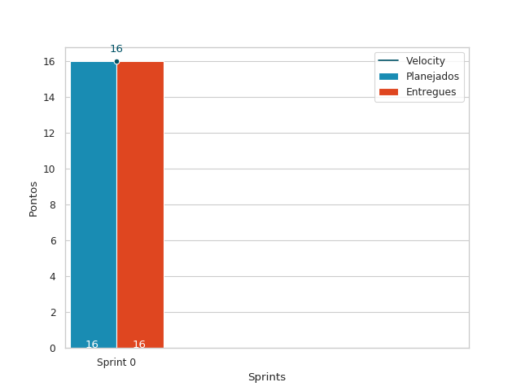

# Resultados da sprint 0

## Informações básicas

|Pontuação|Valores|
|-----|-----|
|Planejada|16|
|Total entregue|16|
|Dívida técnica|-|

## Issues

|Nome da issue|Pontos|Situação|
|-----|-----|----|
|[Add issues templates](https://github.com/fga-eps-mds/2019.1-unbrake/issues/2)|2|Fechada|
|[Linguagem oficial do repositório](https://github.com/fga-eps-mds/2019.1-unbrake/issues/4)|1|Fechada|
|[Name for the project](https://github.com/fga-eps-mds/2019.1-unbrake/issues/5)|1|Fechada|
|[Setup initial frontend environment](https://github.com/fga-eps-mds/2019.1-unbrake/issues/10)|5|Fechada|
|[Docker-compose incomplete](https://github.com/fga-eps-mds/2019.1-unbrake/issues/14)|1|Fechada|
|[Initial meeting with developer team and git training - Meeting 1](https://github.com/fga-eps-mds/2019.1-unbrake/issues/16)|3|Fechada|
|[Agile methodologies and networks basic concepts training - Meeting 2](https://github.com/fga-eps-mds/2019.1-unbrake/issues/17)|3|Fechada|

## Burndown

## Velocity

## Comentários do Scrum Master

A Sprint 0 foi o ponto de partida, na prática, do projeto. Ela teve o objetivo principal de estabelecer questões relativas ao escopo do prprojeto com o prof. Evndro, o cliente e maior interessado no produto, principalmente se tratando de questões de lincceça do software. Após o grupo de EPS e o professor entrarem em um acordo, com a decisão do professor de permitir o código do sistema ser aberto, foi possível enfim iniciar discussões mais focadas em questões técnicas, envolvendo a arquitetura e as tecnologias, por exemplo.

Além disso, nesse momento inicial, EPS decidiu que era importante introduzir conceitos básicos que os membros de MDS ainda não haviam estudado ao longo do curso, como redes de computadores, que não eram atrelados diretamente ao desenvolvimento do projeto em si. Essa decisão foi tomada tendo em vista a visão do grupo de que um engenheiro de software deve possuir conhecimentos amplos, não se restringindo a um pequeno conjunto de ferramentas e linguagens, e que os conceitos ou o saber como funciona são mais importantes do que apenas usar um framework específico. Isso se confirma também ao se olhar para as exigências das empresas e do mercado de tecnologia atual, que demandam muitas vezes em uma única oferta de vagas conhecimentos bastante amplos, podendo ir, por exemplo, de sistemas distribuídos à linguagens funcionais.

