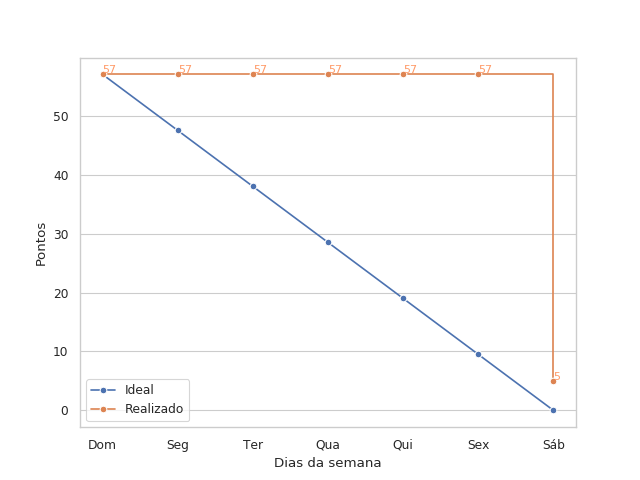
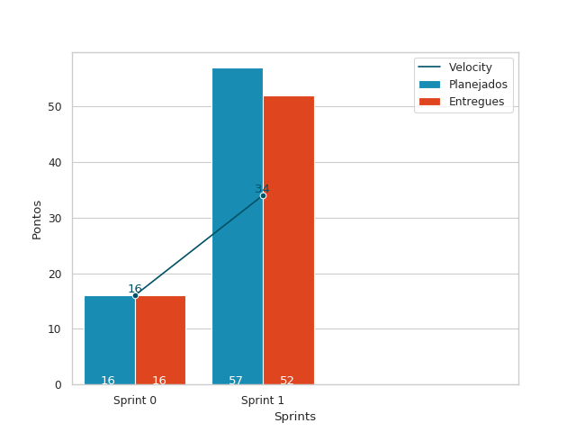

# Resultados da Sprint 1  

## Informações básicas

|Pontuação|Valores|
|-----|-----|
|Planejada|57|
|Total entregue|52|
|Dívida técnica|5|

## Issues

|Nome da issue|Pontos|Situação|
|-----|-----|----|
|[Create Sidebar Menu](https://github.com/fga-eps-mds/2019.1-unbrake/issues/7)|5|Fechada|
|[Create Login page](https://github.com/fga-eps-mds/2019.1-unbrake/issues/8)|8|Fechada|
|[Create real time chart](https://github.com/fga-eps-mds/2019.1-unbrake/issues/11)|13|Fechada|
|[Create form for configuration module](https://github.com/fga-eps-mds/2019.1-unbrake/issues/9)|3|Não fechada|
|[Setup initial CI](https://github.com/fga-eps-mds/2019.1-unbrake/issues/13)|3|Fechada|
|[Setup frontend linter and stylesheet tools](https://github.com/fga-eps-mds/2019.1-unbrake/issues/18)|3|Fechada|
|[Criar cenários para documentação da arquitetura](https://github.com/fga-eps-mds/2019.1-unbrake/issues/20)|8|Fechada|
|[Criar Termo de Abertura do Projeto (TAP)](https://github.com/fga-eps-mds/2019.1-unbrake/issues/22)|2|Fechada|
|[Criar github-pages para documentação do projeto](https://github.com/fga-eps-mds/2019.1-unbrake/issues/24)|5|Fechada|
|[Tradução das issues templates](https://github.com/fga-eps-mds/2019.1-unbrake/issues/25)|1|Fechada|
|[Planejar reunião de abertura da Sprint 2 - Reunião 4](https://github.com/fga-eps-mds/2019.1-unbrake/issues/27)|1|Fechada|
|[Treinamento de Docker e React/Redux - Reunião 3](https://github.com/fga-eps-mds/2019.1-unbrake/issues/28)|1|Fechada|
|[Criar Estrutura Analítica do Projeto (EAP)](https://github.com/fga-eps-mds/2019.1-unbrake/issues/29)|2|Não fechada|
|[Configuração inicial de regras de estilo e linting](https://github.com/fga-eps-mds/2019.1-unbrake/issues/30)|1|Fechada|
|[Consertar eslint-plugin-react 'react/prefer-stateless-function'](https://github.com/fga-eps-mds/2019.1-unbrake/issues/35)|1|Fechada|

## Burndown

## Velocity

## Dailies
|Nome| Seg| Ter| Qua| Qui| Sex|
|-|----|----|----|----|----| 
|Gabriel|x|x|x|x||
|Felipe|x|x|x||x|
|Ícaro|x|x|x|x|x|
|João|x|x|x|x|x|
|Letícia|x|x|x|x|x|
|Lucas|x|x|x|x|x|
|Thiago|x|x|x|x|x|
|Victor|x|x|x|x|x|
|Vinicius||x||x|x|

## Quadro de conhecimentos

 
 
 

## Comentários do Scrum Master

A Sprint 1 marcou o início do desenvolvimento do sistema. O fato de um treinamento que durou um tempo razoável e foi composto de partes teóricas e práticas ter sido realizado no início da sprint somado ao fato das issues que foram estabelecidas serem baseadas em componentes simples do React, facilitou o entendimento inicial das duplas na hora de desenvolverem seus códigos. Um fato que também ajudou na entrega de 3 das 4 issues planejadas foi o da ausência nesse momento inicial da obrigatoriedade da realização de testes unitários assim como de folha de estilo e critérios de qualidade mais rigorosos. Isso se deve por dois fatores: o escopo do projeto UnBrake é consideravelmente grande e o quanto antes o desenvolvimento iniciasse e o time de desenvolvimento se ambientasse com as tecnologias, mais entregas até o fim do projeto poderão ser feitas e menos dificuldades técnicas serão enfrentadas até lá também; as ferramentas de checagem automática de código e a integração contínua tiveram sua configuração iniciada nessa sprint e só puderam ser disponibilizadas ao seu final.

Essa sprint teve como ponto principal também a criação do Termo de Abertura do Projeto. Inicialmente, havia o planejamento de entregar a EAP (Estrutura Analítica do Projeto) conjuntamente, porém, por conta apoio que os membros de EPS tiveram que dar aos membros de MDS com a parte tecnológica e as dificuldades enfrentadas para configurar o GitHub Pages utilizando o Pelican, um gerador de sites estáticos, esse documento não pôde ser entregue antes do prazo.

A outra issue que sofreu atraso na entrega foi a do formulário do módulo de configuração. Esse componente é composto de duas partes, sendo que uma é um campo para o upload de um arquivo que é do formato ".ini". Sendo assim, após o upload, esse arquivo deve passar por um <i>parser</i> para transformar as informações nele contidas em um objeto. Isso representou uma dificuldade bastante grande para o desenvolvedor responsável e a issue, que começou a ser feita no final da sprint, não foi concluída.

