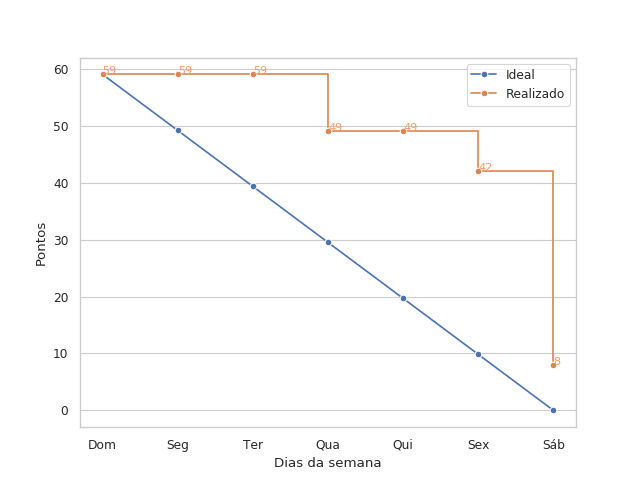

# Resultados da Sprint 3

## Informações básicas

|Pontuação|Valores|
|-----|-----|
|Planejada|59|
|Total entregue|51|
|Dívida técnica|8|

## Issues

|Nome da issue|Pontos|Situação|
|-----|-----|----|
|[Create form for configuration module](https://github.com/fga-eps-mds/2019.1-unbrake/issues/9)|3|Não fechada|
|[Criar autenticação de usuário](https://github.com/fga-eps-mds/2019.1-unbrake/issues/36)|13|Fechada|
|[Criar view para receber configurações](https://github.com/fga-eps-mds/2019.1-unbrake/issues/38) |13|Fechada|
|[Criar formulário para calibração de temperatura](https://github.com/fga-eps-mds/2018.1-unbrake/issues/39) |5|Fechada|
|[Realizar integração da autenticação no front-end](https://github.com/fga-eps-mds/2019.1-unbrake/issues/47) |8|Fechada|
|[Melhorar o tema da página do projeto](https://github.com/fga-eps-mds/2019.1-unbrake/issues/62) |5|Fechada|
|[Fazer o jest falhar em caso de warning](https://github.com/fga-eps-mds/2019.1-unbrake/issues/68)|1|Fechada|
|[Atualizar README com comandos de execução e checagem](https://github.com/fga-eps-mds/2019.1-unbrake/issues/70)|1|Fechada|
|[Criar comandos do manage.py semelhantes aos criados no npm](https://github.com/fga-eps-mds/2019.1-unbrake/issues/72)|2|Fechada|
|[Criar diagrama de classes do Django](https://github.com/fga-eps-mds/2019.1-unbrake/issues/74)|3|Fechada|
|[Entender o funcionamento da linguagem Go](https://github.com/fga-eps-mds/2019.1-unbrake/issues/78)|5|Não fechada|

## Burndown

## Velocity

## Dailies
|Nome| Seg| Ter| Qua| Qui| Sex|
|-|----|----|----|----|----| 
|Gabriel||x|x|x|-|
|Felipe|x|x|||-|
|Ícaro|x|x||x|-|
|João|x|x|x|x|-|
|Letícia|x|x|x|x|-|
|Lucas|x|x|x|x|-|
|Tiago|x||x|x|-|
|Victor|||x|x|-|
|Vinicius||x||x|-|

## Retrospectiva

### Pontos ruins

* GSOC e Code Jam com datas no meio da sprint;
* Indecisão sobre qal banco de dados escolr;
* Issue para criar diagrama de classes confusa;
* Muita rigidez das ferramentas de checagem de código;
* Algumas pessoas chegando atrasadas nas dailies;
* Comunicação;
* Comentários nos PR's demorando a serem vistos e corrigidos;
* Títulos dos commits/PR's ruins;
* Master estar bastante desatualizada com a devel.

### Pontos bons

* Gosto em fazer a issue passada;
* Começo de um entendimento mais profundo de como os componentes do software se comunicam/funcionam;
* Time de desenvolvimento começar a escrever documentos;
* Pessoas mais a vontade para parear. 

### Melhorias

* Planejar e tomar decisões com maior antecedência;
* Decidir tamanho das issues de maneira melhor;
* Criar o backlog do produto;
* Decidir qual banco usar;
* Configurar pull reminders.

## Quadro de conhecimentos

 
 
 

## Comentários do Scrum Master

Sprint onde desenvolvedores começaram a apresentar uma maturidade maior, ficando mais a vontade para realizar pareamentos e onde começaram a escrever os documentos também. Pela primeira vez, uma quantidade grande de issues foi de dívida técnica, justificado principalmente pelo alto grau de exigência de qualidade de código e outros critérios como ferramenta de checagem de tipo. Nessa sprint, uma issue que vale a pena ser destacada é a referente ao entendimento da linguagem Go, onde se começou a investigar/estudar como se constrói um servidor em Go.

